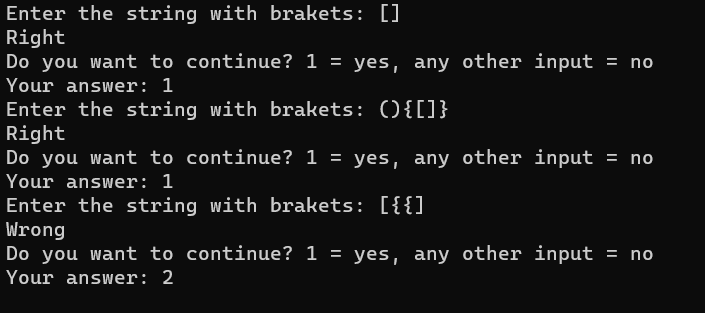

# Brackets_check

This small program is a solution to the problem of checking pairs of brackets. If the user entered brackets correctly or incorrectly, he will get the answer "Right" or "Wrong". The result of the program is shown in the picture.   

